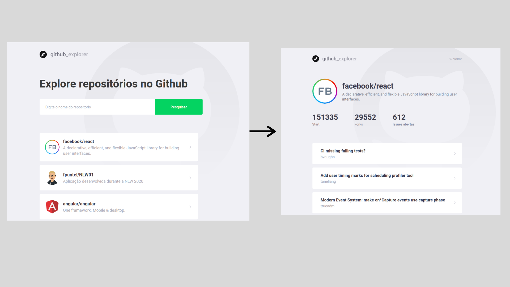

<h3 align="center">
  Conceitos do React para desenvolvimento de aplicação para controle de repositórios do github
</h3>

  

  

  

  

## :rocket: Sobre a aplicação

Neste aplicação utilizou-se o React para desenvolvido de um sistema para buscar e adicionar repositórios do github.

